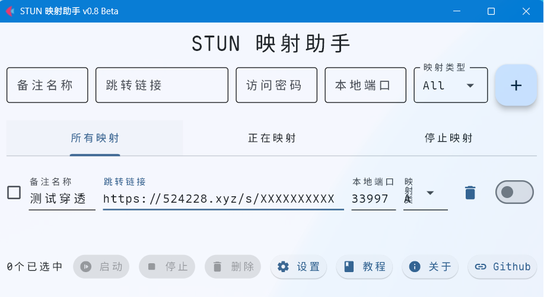
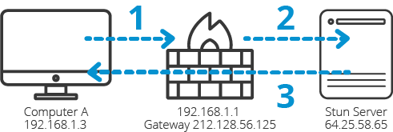
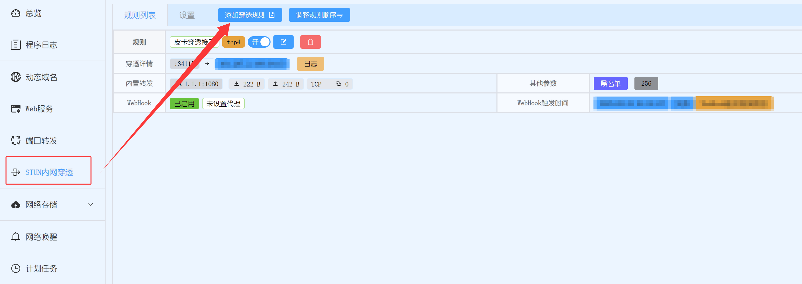
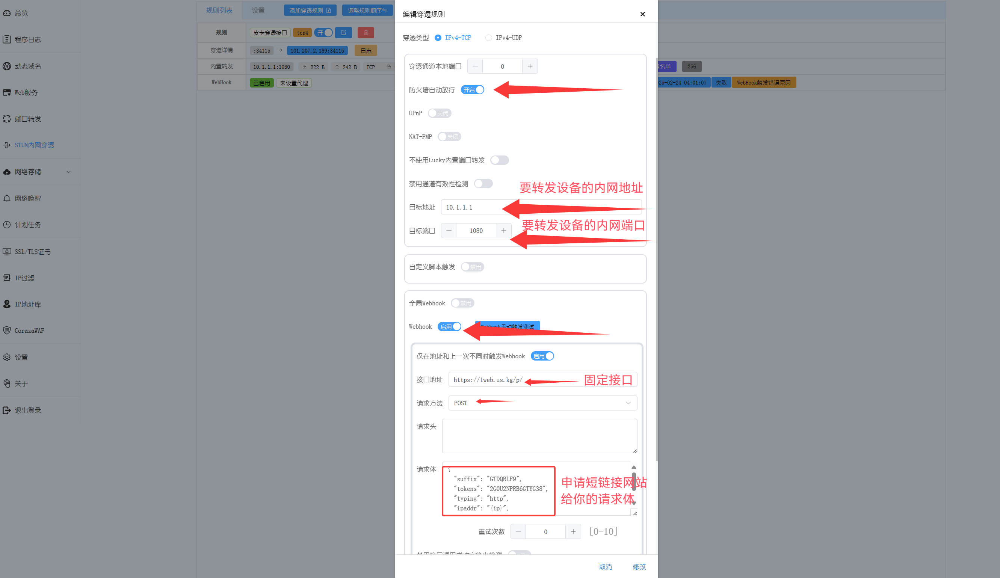
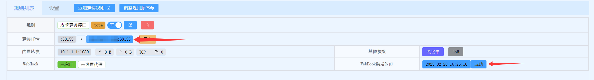
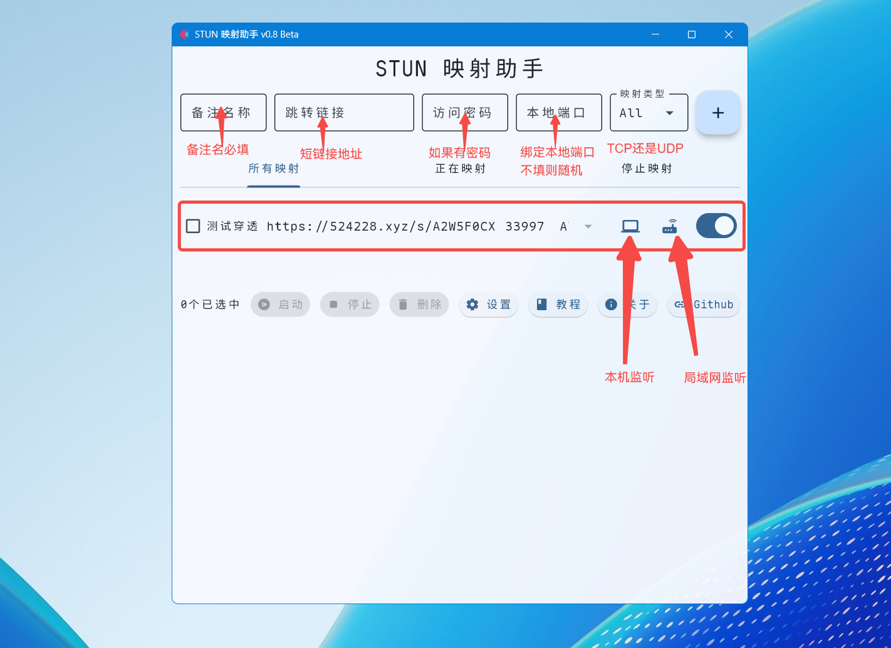

# STUN Connects: A Tool for Auto STUN Port Mapping

# STUN 映射助手：用于自动重定向连接STUN端口工具

## 软件介绍

**STUN映射助手** 是一款针对NAT（网络地址转换）环境设计的工具，它需要配合[CFWorkerUrls](https://github.com/PIKACHUIM/CFWorkerUrls)服务共同将内网的私有服务经过STUN转发绑定到本地。在使用工具前，你需要将（如远程桌面RDP、SSH、私有游戏服务器等）通过Lucky等工具使用STUN绑定到公网，并使用[短域名服务](https://1web.us.kg/)配置自动重定向。最后通过短链接服务和STUN 映射助手，它将自动抓取动态公网端口，并绑定到本地的固定端口，让你像访问本地服务一样轻松连接远端的NAT设备。




## 应用场景

随着运营商逐步回收家庭宽带的公网IPv4地址，传统基于公网IPv4的内网直连方案基本都不能用了，尽管IPv6能解决地址不足问题，但其实际部署仍存在兼容性问题（办公学校等环境还没有支持IPV6），好在现在可以通过STUN协议探测NAT类型、NAT1/UPnP主动开放端口，且无需中转服务器就能访问内网，并结合重定向技术，实现在无公网IPv4且IPv6不完善情况下，直接穿透内网，无需第三方服务器中转

### **功能亮点**

1. **全自动端口重定向**
   - 自动识别STUN服务的公网IP和动态端口，无需手动查询或配置。
   - 动态绑定到本地固定端口（如将远端RDP服务的3389端口映射到本地的13389端口）。
2. **支持任意TCP/UDP协议**
   - 不限制协议类型，无论是远程桌面（RDP）、SSH、数据库服务，还是游戏服务器（如Minecraft）等，均可穿透。
   - 直接复用本地工具（如远程桌面客户端、Termius等），无需改造适配。
3. **短链接服务整合**
   - 通过短域名（如`your.domain.com`）自动解析最新公网地址，解决动态IP和端口变化的问题。
   - 用户只需记住一个固定域名，工具自动更新后端动态端口，实现“一次配置，长期可用”。

### **应用场景**

- **远程办公**：在外直接连接公司内网的RDP、SSH服务，无需VPN。
- **私有服务外访**：将家庭NAS、智能家居的管理页面暴露到公网，安全可控。
- **联机游戏**：解决P2P游戏NAT严格导致的联机失败问题。
- **临时测试**：快速对外提供测试环境，关闭后自动释放，无残留配置。


### **技术优势**

- **零依赖**：无需公网服务器，仅需一个短域名+STUN服务即可。
- **低延迟**：直接通过STUN建立的P2P通道传输数据，无需中转服务器。
- **轻量化**：占用资源极少，后台静默运行，不干扰其他服务。

##  软件原理

1. **STUN穿透：获取公网身份**
   - 设备启动后，通过内置的STUN服务（如Lucky的STUN服务）与公网服务器通信，获取当前NAT分配的公网IP和端口，相当于给内网服务打上“临时外网门牌号”。
2. **短域名绑定：动态门牌变固定地址**
   - 将STUN获取的动态IP和端口，通过API更新到短域名服务（如DDNS服务），生成一个固定域名（如`your.domain.com`）。
   - 即使公网端口变化，短域名会实时指向最新端口，外部用户始终通过同一个域名访问。
3. **本地端口映射：穿透NAT直达服务**
   - 工具持续监听短域名的解析结果，一旦发现公网端口变化，立即将新端口与本地固定端口（如本地的13389端口）绑定。
   - 用户访问本地端口时，流量自动通过STUN通道转发到远端NAT后的服务，实现“本地化”体验。




## 安装方法

### 1、Windows / Linux
1.从[发行版本](https://github.com/PIKACHUIM/StunConnects/releases)下载二进制文件
2.启动`StunConnects`即可

### 2、Docker 直接运行

#### 直接启动

使用下列命令启动docker容器

```shell
docker run -d --network host --name porter-container pikachuim/porter:latest
```
中国用户可以使用
```shell
docker run -d --network host --name porter-container docker.opkg.us.kg/pikachuim/porter:latest
```


然后您可以通过`ip:1680`访问您的管理页面，您可能需要放行防火墙

### 3、Docker Compose

创建一个`docker-compose.yml`

```yaml
version: '3.8'  # Docker Compose 版本
services:
  porter-container: # 定义服务名称
    image: pikachuim/porter:latest  # 使用的镜像
    container_name: porter-container  # 容器名称
    network_mode: host  # 使用 Host 网络模式
    restart: unless-stopped  # 重启策略
```

然后启动docker：

```shell
docker-compose up -d
```

## 可选参数

### 隐藏窗口

不会显示窗口，静默启动程序
```shell
StunConnects.exe --hide-window
```

### 服务模式
非交互式启动，无头服务器用
```shell
StunConnects.exe --flag-server
```

## 使用方法
### 确认NAT类
打开：https://mao.fan/mynat 
>  - 如果是NAT1，打开防火墙就可以穿透
>  - 如果是NAT2，需要打开UPNP和防火墙
>  - 如果是NAT3，需要打开UPNP和防火墙
>  - 如果是NAT4，不用尝试了，肯定不行


### 申请链接
申请地址：https://1web.us.kg/，『目标地址』需要随便填写一个


### 保存内容
1. 链接/s/后面的AABBCCDD是suffix网站后缀
2. 更新密码要保存好，只会显示一次，无法恢复


### 设置Lucky
1. 安装Lucky，教程：https://lucky666.cn/docs/install
2. 打开Lucky——STUN穿透设置——新增设置本地地址端口：

3. STUN穿透设置——启用Webhook，设置Webhook 更新地址：

 - 请求地址：`https://1web.us.kg/p/`
 - 请求类型：`POST`
 - 请求内容：
```
{
  "suffix": "网站后缀",
  "tokens": "更新密码",
  "typing": "http",
  "ipaddr": "{ip}",
  "porter": "{port}"
}
```

### 测试Lucky
1. 保存之后，等待STUN穿透和更新URL地址
2. 打开：https://1web.us.kg/s/XXXXXXXX
2. 如果能正常打开则穿透已经成功！！！！



### 设置Ports（可选）
#### StunConnects说明

> 正常情况上面的步骤就可以使用了
> 但是STUN穿透的地址是动态变化的
> 并且URL重定向只支持Web协议穿透
> StunConnects就是解决这个问题的
> ①固定本地端口 ②支持非WEB协议


#### StunConnects使用
1. 打开StunConnects（桌面APP）或者IP:1680（Docker）
2. 新增连接映射：
> 映射备注：您自己设置一个名称
> 跳转链接：上一步成功的短链接
> 本地端口：监听本地端口，不填则随机生成



3. 复制本地或者云端地址，在浏览器或软件进行测试